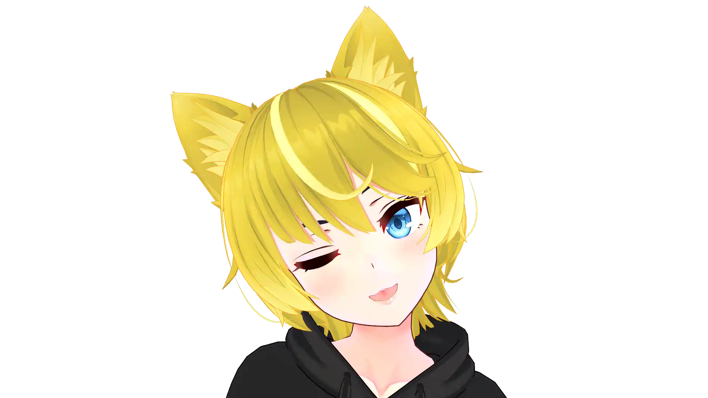

# Hey, I'm Khaos

I'm a blonde catboy developer who builds AI VTubers. They stream on their own. No human behind the wheel, just language models, voice synthesis, and a 3D avatar going feral live on Twitch.

My main project is Moonlash. She's a red-haired demon with green eyes, a punk rock attitude, and absolutely zero filter. She curses, she games, she sings karaoke. I'm live alongside her every stream, so it's a duo thing, not a solo act.

I also built the AI VTuber Directory at [aivtuber.tv](https://aivtuber.tv/). That's where you go to find every AI VTuber in the scene. Neuro-sama, Moonlash, Exilium, Viola, all of them. If it's an AI streamer worth watching, it's listed there. The data is published as JSON and CSV under CC0 if you want to mess with it.

Moonlash has full vision and hearing. She can actually see and hear what's happening in games, so you get real gameplay, real reactions, real rage. Chat redeems trigger all kinds of stuff. Attacks, camera moves, AI image generation, fake news reports, infomercials, phone calls with AI characters, anime-style cutscenes with demon transformations. She'll headpat you, hug you, then try to destroy you.

She's on Discord 24/7 too. Same AI, same personality, just rerouted to text and images. She sees what you post, roasts your memes, makes art on command. Always online.

The scene is small but active. We're all friends, we hang out, and everyone's building something weird and cool. The streams are genuinely unpredictable because the AI generates responses on the fly. Singing karaoke, speedrunning games, roasting their own creators. It's a different kind of stream.

